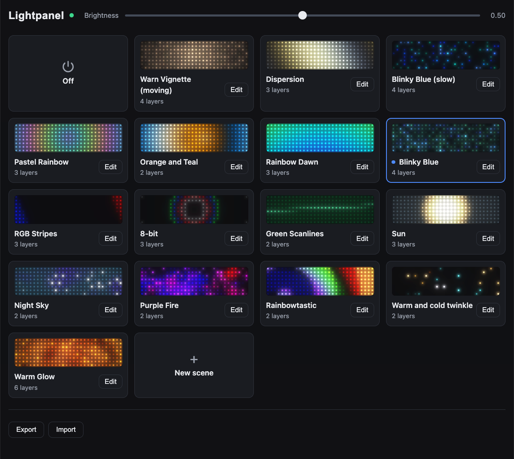
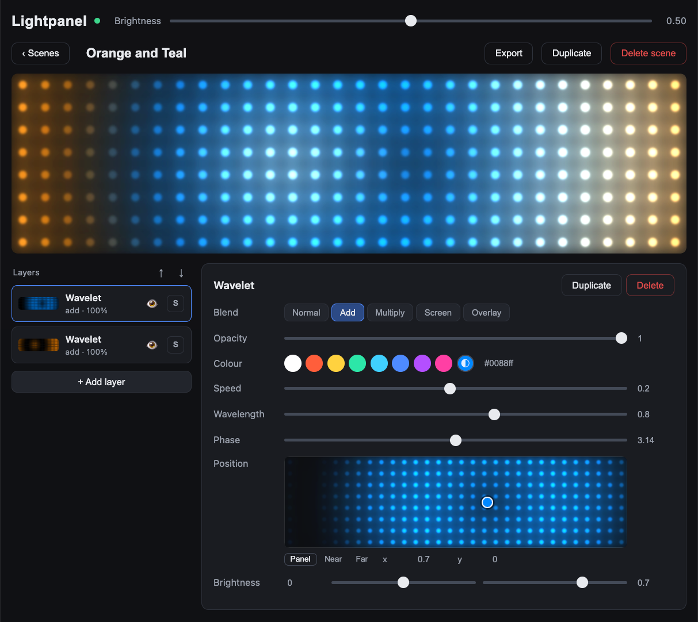

# NeoPixel Light Panel

A web-controlled LED light panel built from NeoPixel strips and a Fadecandy controller. A Node.js server drives the animations at 100 FPS while a React UI works as a visual mixer: each scene is a stack of effect layers (waves, gradients, particles, noise) composited with blend modes and opacity, edited live with direct-manipulation controls and switched from any browser on the network.

Video demo: https://youtu.be/4FmCFS33W90

<p>
  
  
</p>

## Hardware

The panel is eight half-metre lengths of 60 pixel/m NeoPixel strip (240 LEDs total, arranged as a 30x8 grid). Each strip connects to its own channel on a [Fadecandy](https://github.com/scanlime/fadecandy) board, which is USB-connected to a Raspberry Pi running the server.

You will need:

- 8x 0.5m NeoPixel strips (60 LED/m, WS2812B or compatible)
- 1x Fadecandy board
- A Raspberry Pi (or any Linux/macOS/Windows machine with Node.js)
- 5V power supply rated for the strip current draw
- The Fadecandy server binary (`fcserver`) running on the same host, listening on port 7890

If you don't have the hardware, the server can run in **virtual mode** (`VIRTUAL=1`), which replaces the Fadecandy connection with a WebSocket that streams pixel data to the UI's built-in LED visualiser.

### Power

- **Current.** 240 WS2812B at full white is about **13.4 A at 5 V**, and almost nothing else comes close — Fadecandy's gamma curve means a mid-grey frame draws roughly a fifth of that, so ordinary scenes sit far below the worst case.
- **Voltage sag.** If the Pi runs off the same supply, a solid-white frame can drop the rail far enough to trip its undervoltage detection, even on a PSU with amps to spare — the resistance of leads and connectors bites before the current rating does. Thicker leads or power injection help more than a bigger PSU.
- **Current limiting.** The server estimates the draw and can hold frames inside a configurable budget (`GET|PUT /api/power`, and the "Power budget" panel in the UI settings).

## Prerequisites

- Node.js 24+ (what the Pi, CI and the lockfile use; `engines` in the root `package.json` says so)
- npm 7+ (for workspace support)

For hardware mode only:

- `fcserver` running and accessible (defaults to `localhost:7890`)

## Getting started

```bash
git clone <this repo>
cd neopixel-light-panel
npm install
```

### Development (virtual mode, no hardware needed)

```bash
npm run dev
```

This starts the API server on port 3000 in virtual mode and the UI dev server on port 3002. Open http://localhost:3002 in a browser. The UI connects to the server automatically and shows a live LED visualiser.

### Production (with Fadecandy hardware)

Start the Fadecandy server first:

```bash
fcserver fcserver.json
```

Then start the light panel server:

```bash
npm start
```

The server listens on port 3000. It serves a production build of the UI from `packages/ui/dist/`, so build the UI first if you haven't already:

```bash
npm run build --workspace=packages/ui
```

Then open http://\<pi-hostname\>:3000 in a browser.

### Deploying to a Pi

The UI and server deploy the same way: `npm run deploy` runs `scripts/deploy-pi.sh`, which SSHes to the Pi, pulls `origin/main`, installs dependencies, builds the UI, and restarts the service — no local build step, so the Pi always ends up running exactly what's on GitHub.

```bash
npm run deploy
```

This assumes the Pi is reachable via an SSH host alias named `blinky` (Node 24 via nvm, since the Pi builds the UI itself), with passwordless sudo for restarting `lightpanel.service`, and the repo cloned to `/home/pi/github/neopixel-light-panel/`. Edit `scripts/deploy-pi.sh` to match your setup.

### Services on the Pi

The systemd units live in `packages/server/`. The deploy script doesn't install them: copy a changed unit into `/etc/systemd/system/` yourself, then run `sudo systemctl daemon-reload` and restart it.

| Unit | Runs | Needed |
|------|------|--------|
| `fcserver.service` | `fcserver` against the repo's `packages/server/fcserver.json`, the same file the power estimate reads its gamma from | yes |
| `lightpanel.service` | `app.js` under the newest installed Node 24 (via `~/.nvm/nvm-exec`, so an `nvm install` of a patch release doesn't break it) | yes |
| `power-watch.service` | `scripts/power-watch.sh`: follows the kernel log for undervoltage messages into `~/power-watch.log` | optional, for diagnosing supply sag |
| `power-monitor.service` | `scripts/power-monitor.sh`: logs throttling flags, CPU temperature, brightness and active scene once a second to `~/power-monitor.log` | optional, for correlating sag with what was on screen |

All four assume user `pi` and the repo at `/home/pi/github/neopixel-light-panel/`.

## Configuration

| Variable | Default | Purpose |
|----------|---------|---------|
| `VIRTUAL` | unset | Set to `1` to run without Fadecandy hardware |
| `FADECANDY_SERVER` | `localhost` | Hostname of the Fadecandy server (port is always 7890) |
| `REACT_APP_LIGHTPANEL_API_SERVER` | `http://localhost:3000` | Backend URL, used by the UI |
| `REACT_APP_LIGHTPANEL_WS_SERVER` | derived from API URL, port 3001 | WebSocket URL for the LED visualiser |

**Security posture:** the API has no authentication and is meant for a trusted home LAN only — do not port-forward it. It answers cross-origin requests only from the Vite dev server (`http://localhost:3002`, and only when `VIRTUAL` is set), and refuses any state-changing request that a foreign web page sends, so a page someone on the network happens to visit cannot drive the panel. See `packages/server/routes/origin.js`.

## How it works

The project is an npm workspaces monorepo with two packages.

### `packages/server/` -- API server and animation engine

The server is a small Express app (`app.js`) with a `setInterval` render loop running at 100 FPS. On each tick the compositor renders every layer of the active scene into its own buffer, blends them bottom→top with per-layer opacity and one of eleven blend modes (normal, add, screen, lighten, subtract, multiply, darken, difference, overlay, soft light, linear light), and writes the result out via the Open Pixel Control protocol.

Effects live in `effects/` as self-contained modules — each declares a parameter schema (which drives the UI), precomputes expensive work on the API write path, and keeps per-layer animation state in an instance, so two particle layers animate independently. Current effects: wavelet, plane wave, solid colour, linear gradient, radial gradient, emitter, particle trail, noise field, twinkle, text (including clocks).

`opc.js` is the OPC client that talks to Fadecandy over TCP; `virtual-opc.js` is a drop-in replacement used when `VIRTUAL=1` is set. In both modes `engine/broadcast.js` streams pixel state over a WebSocket on port 3001 for the UI's live previews (composite at ~30 FPS, plus optional per-layer frames for the editor).

Scenes and settings (brightness, the frame-stats toggle) are persisted to crash-safe JSON files in `packages/server/data/` (atomic tmp+rename writes with a `.bak` fallback, debounced to be SD-card friendly) so a power cut can't lose them.

### `packages/ui/` -- React control interface

A React 19 app built with Vite (zustand for state). The default view is a scene switcher — a responsive card grid with a live preview on the active scene, designed to work well on a phone. Opening a scene switches to the editor: a large read-only live preview, a layer stack with animated per-layer thumbnails, and a parameter panel rendered from each effect's schema (colour swatches, XY pads, gradient-stop strips, perceptual sliders). Edits stream to the server as you drag — the panel itself is the ultimate preview. The cog in the header opens a settings page holding the power budget and whole-library import/export.

## API

See [API.md](API.md) for full HTTP API documentation, suitable for building your own integrations.

## Contributing

Before changing the code, read [CLAUDE.md](CLAUDE.md). It is written for Claude Code but is the architecture doc for humans too: the cross-module rules, the commands, and the repo's working conventions. Deeper rationale sits beside the code: in file header comments on the server, in [`packages/server/engine/CLAUDE.md`](packages/server/engine/CLAUDE.md) and [`packages/server/effects/CLAUDE.md`](packages/server/effects/CLAUDE.md), and in the nested `CLAUDE.md` files under `packages/ui/src/`. Outstanding work is tracked as GitHub issues.
